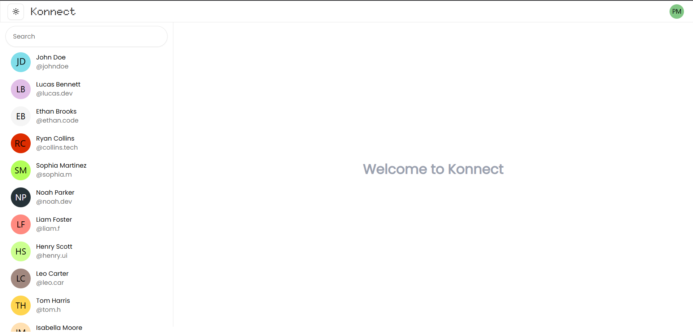
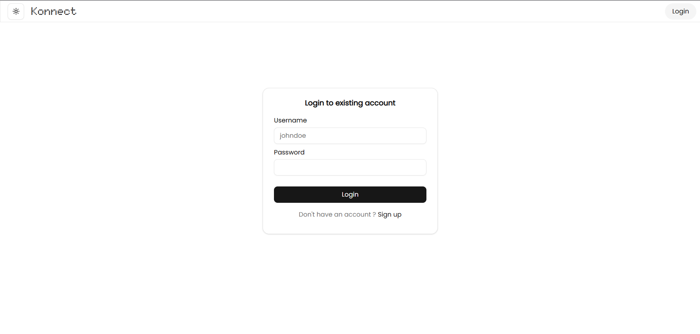
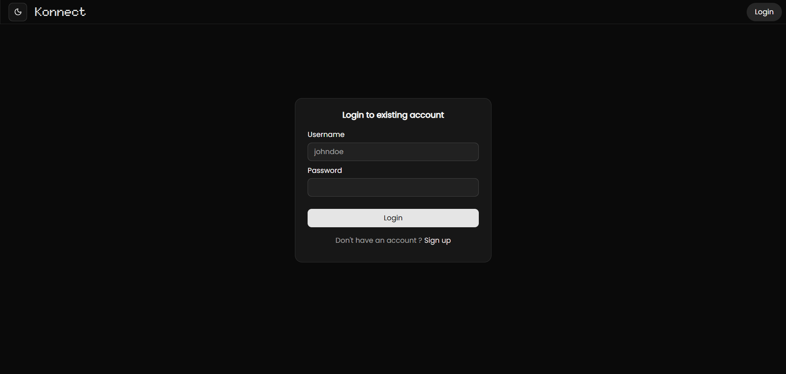
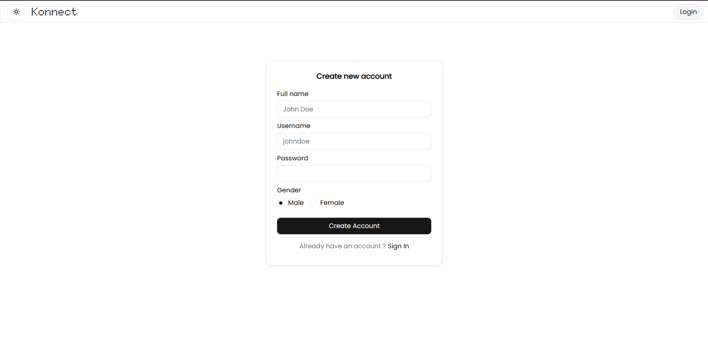
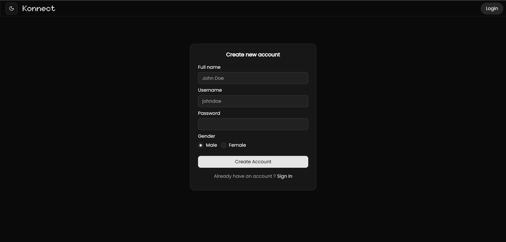
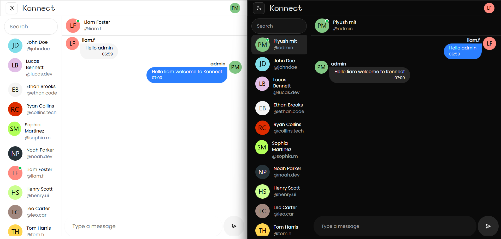
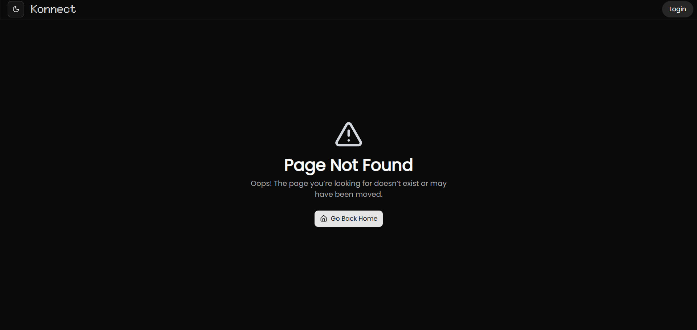

# 💬 Konnect – Real-Time Chat Application


---

## 📌 Overview

**Konnect** is a real-time **one-to-one chat application** built using the **MERN stack** and **Socket.io**.  
It enables users to securely authenticate, see live online/offline presence, and exchange messages instantly with persistent chat history.

The project focuses on **real-time systems**, **secure authentication**, and **clean full-stack architecture**, making it a strong portfolio-ready application.

---

## ✨ Features

### 🔐 Authentication & Security
- Secure user signup and login
- JWT-based authentication stored in **HTTP-only cookies**
- Password hashing using **bcrypt**
- Protected routes for authenticated users
- CORS configured for controlled client–server access

### 💬 Real-Time One-to-One Chat
- Instant messaging using **Socket.io (WebSockets)**
- Efficient handling of socket connect & disconnect events
- Direct user-to-user chat (no group chats)

### 🟢 Live User Presence
- Real-time online/offline status tracking
- Presence updates on socket connection changes

### 💾 Message Persistence
- Chat history stored in **MongoDB**
- Conversations restored on user login
- Messages linked to chats for efficient querying

### 🎨 Modern UI
- Fully responsive interface
- Light & Dark theme support
- Built with **Tailwind CSS** and **Shadcn UI**

---

## 🛠 Tech Stack

### Frontend
- React (Vite)
- TypeScript
- Redux Toolkit
- React Router
- Tailwind CSS
- Shadcn UI
- Axios

### Backend
- Node.js
- Express.js
- TypeScript
- MongoDB
- Mongoose ODM
- JWT (HTTP-only cookies)
- bcrypt
- Socket.io
- Zod
- REST APIs

---

## 🧠 Architecture

The backend follows a **Model–View–Controller (MVC)** architecture:

- **Routes** – API endpoint definitions
- **Controllers** – Request/response logic
- **Models** – MongoDB schemas
- **Middlewares** – Auth, validation, error handling
- **Socket Layer** – Real-time messaging & presence

Frontend and backend are maintained in **separate folders** for scalability.

---

## 📸 Screenshots

### 🏠 Landing Page / Chat section (Light Theme)


### 🌙 anding Page / Chat section (Dark Theme)


### 🔐 Sign In Page (Light)


### 🌙 Sign In Page (Dark)


### 📝 Sign Up Page (Light)


### 🌙 Sign Up Page (Dark)


### 🌙 Realtime chat and online status badge


### ❌ 404 – Not Found Page


---

## 🔐 Environment Variables

### Backend (`server/.env.example`)
```env
PORT=3000
MONGO_URL=your_mongodb_connection_string
CLIENT_URL=http://localhost:XXXX
JWT_SECRET=your_jwt_secret
NODE_ENV=development
```

### Frontend (`client/.env.example`)
```env
VITE_REACT_APP_BACKEND_BASEURL=http://localhost:XXXX
```

---

## 🚀 Local Setup

### Prerequisites
- Node.js
- MongoDB
- Git

### Clone Repository
```bash
git clone https://github.com/Piyush-mit/Learning-Through-Projects.git
cd Konnect
```

### Backend Setup
```bash
cd server
npm install
npm run dev
```

### Frontend Setup
```bash
cd client
npm install
npm run dev
```

---

## 📂 Project Structure

```
Konnect/
│
├── client/
│   ├── src/
│   │   ├── actions/
│   │   ├── assets/
│   │   ├── components/
│   │   ├── lib/
│   │   ├── Pages/
│   │   ├── redux/
│   │   ├── socket/
│   │   └── api.ts
│   └── main.tsx
│
├── server/
│   ├── src/
│   │   ├── config/
│   │   ├── controllers/
│   │   ├── middlewares/
│   │   ├── models/
│   │   ├── routes/
│   │   ├── socket/
│   │   └── index.ts
│
├── screenshots/
└── README.md
```
---

## 👤 Author
**Piyush Mit**  
Solo Developer

---

## 📄 License
MIT License
